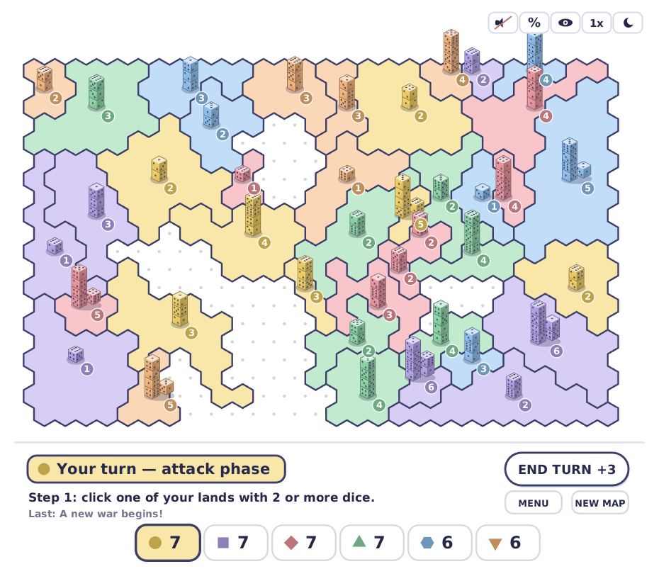
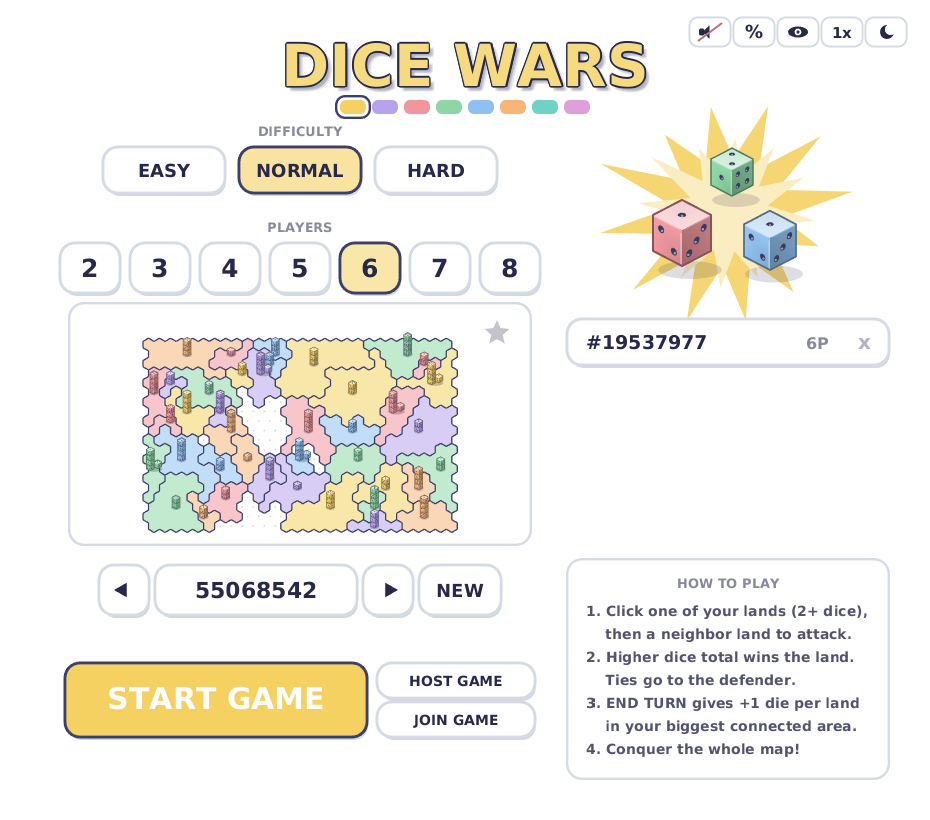

<div align="center">

# 🎲 Dice Wars

**A pastel Dice Wars–style territory conquest game in Rust.**

Hex maps · isometric dice · hidden AI personalities · seeded & bookmarkable maps · replays with GIF export · procedural sound

  





</div>

## Run / install

```sh
./run.sh              # build & play (or: cargo run --release)
scripts/build.sh      # build only — installs the Rust toolchain if missing
scripts/install.sh    # Linux: install to ~/.local/bin + desktop entry
scripts\install.bat   # Windows: install + Start Menu shortcut
scripts\build.bat     # Windows: build only
```

All scripts bootstrap everything needed to build from scratch (rustup, compiler). Settings, bookmarks, and exported replay GIFs live in your platform's user-data directory (`~/.local/share/dice-wars` on Linux, `%APPDATA%\dice-wars` on Windows).

## Start screen

- **Your color** — click a swatch in the band under the title to pick the color you play as; your current pick is highlighted.
- **Players / Humans** — choose 2–8 total players. Pick any color for yourself with the swatch band; every player has a unique color and symbol. For multiplayer, host a lobby — joined players get the first seats and AI fills the rest.
- **Difficulty** — EASY bots hesitate, need a big advantage, and pick sloppy targets; NORMAL plays by personality; HARD bots gamble on even odds, consolidate territory, reinforce their frontlines, and gang up on humans.
- **Mode** — FREE-FOR-ALL is the classic last-player-standing game. TEAMS ends the game when only one team is left alive: pick 2–4 teams and which one you play on (bots spread evenly across the rest), or choose HUMANS VS BOTS to put every human on one side. Everyone still plays for themselves — no shared dice or reinforcements. Two extra rules are toggleable: **Friendly fire** (teammates may attack each other, on by default) and **Islands link via allies** (your separated islands count as one connected region when teammate land bridges them, which boosts END TURN reinforcements — off by default). Bots never attack their own team. Everything persists in `settings.txt` and applies to hosted online games too.
- **Map preview** — the generated map is shown live. Deals are fairness-balanced: every player starts with a comparable largest cluster, equal territory counts, and the first player is decided by the seed.
- **Seed** — maps are deterministic: the same 8-digit seed and player count always produce the same map. Click the seed to type one in, use `<` / `>` to step through neighboring seeds, or `NEW` (or `N`) to skip to a random map.
- **Bookmark map** — saves the current seed + player count to `bookmarks.txt`; click a bookmark to load it, or its `x` to delete it.
- **Chances / Colorblind toggles** — show or hide win-probability hints, and switch to an accessibility mode with a colorblind-safe (Okabe-Ito) palette and owner-symbol badges on every territory. Both persist in `settings.txt`.
- **START GAME** (or `ENTER`) plays the previewed map.

## Online play

**HOST GAME** opens a lobby on TCP port 7777 with a random 6-digit room code and shows your LAN address (with a copy button). Guests join with **JOIN GAME** (address + code); the host presses START whenever ready — connected players get the first seats (host is P1) and AI fills every remaining slot. Works on a LAN or VPN out of the box; across the internet the host needs port 7777 forwarded.

The host is authoritative: guests send intents, the host validates them, rolls the dice, and broadcasts results. Basic hardening is built in — five wrong codes ban that address for the session, connections are rate-limited and capped, and messages are strictly length-limited.

**Can't connect on the same network?** The host's firewall is usually the culprit — on Ubuntu/Mint run `sudo ufw allow 7777/tcp` once. Guest-WiFi networks with "client isolation" also block device-to-device connections. For playing across the internet, either forward TCP 7777 on the host's router or use a VPN like Tailscale (easiest).

## How to play

- **Click one of your territories** (it needs more than 1 die), then **click an adjacent enemy territory** to attack. Selecting a territory shows arrows to every legal target with its exact win probability.
- Both sides roll all their dice — a showcase pops up over the dimmed board with every rolled die and both totals, winner highlighted. Higher total captures the territory (the stack moves in, leaving 1 die); ties and losses reduce the attacker to 1 die.
- The toolbar in the top corner toggles sound, win-chance hints, colorblind mode, 1x/2x game speed, and dark mode — all persisted.
- **END TURN** (or `SPACE`) ends your turn: you receive one die per territory in your largest connected region, distributed randomly. Dice that don't fit (all territories full) are stored off-board — up to 64, like the original — and return on later turns. The button shows your total incoming dice.
- `R` restarts on a fresh random map, `ESC` cancels a selection / returns to the menu, `M` toggles sound.

All sound effects are synthesized procedurally at startup (no audio asset files).

Each AI has a hidden personality, rolled from the map seed — some attack recklessly, some wait for a clear advantage, some scheme against whoever is winning. All bots share a survival instinct: when one player grows dominant, they stop wearing each other down and gang up on the leader.

Win by conquering the whole map — or, in team mode, by being on the last team standing. Player cards show each player's symbol and land count (plus a small +N when they have dice stored off-board, and their team letter in team mode).

## Replays

The game-over screen offers **WATCH REPLAY** — an animated playback of every battle and reinforcement of the finished game — and **SAVE GIF**, which fast-forwards through the replay and writes a timelapse `replay-<seed>.gif` (one frame per event, self-contained GIF encoder, no external tools).

The UI font is DejaVu Sans Bold (embedded from the system fonts, Bitstream Vera license).
